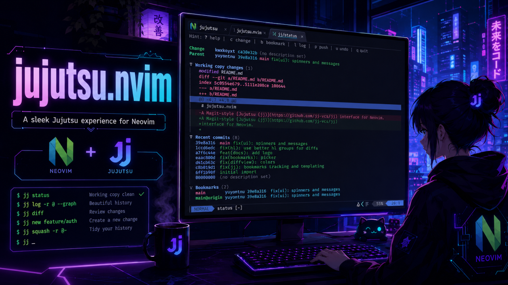

<div align="center">


# jujutsu.nvim

A Magit-style [Jujutsu (jj)](https://github.com/jj-vcs/jj)
interface for Neovim.

---

Inspired by Neogit,
rewritten without required plugin dependencies.



</div>

## Requirements

- Neovim 0.10+
- [`jj`](https://jj-vcs.github.io/jj/) on your `PATH`

**No required Neovim plugins.** Optional:


| Purpose | Pick one |
|---------|----------|
| Diff viewer | [`diffview.nvim`](https://github.com/sindrets/diffview.nvim) or [`codediff.nvim`](https://github.com/esmuellert/codediff.nvim) |
| Picker | Telescope, fzf-lua, mini.pick, or snacks.nvim |


If no picker is installed, a built-in fuzzy finder is used.

## Installation (lazy.nvim)

```lua
{
  "yourname/jujutsu.nvim", -- or local path
  lazy = true,
  -- optional deps:
  -- dependencies = { "sindrets/diffview.nvim", "ibhagwan/fzf-lua" },
  keys = {
    {
      "<leader>gg",
      function()
        require("jujutsu").open()
      end,
      desc = "Jujutsu",
    },
  },
  opts = {}, -- passed to setup()
}
```

There are **no** user commands (`:Jujutsu` isn't registered).
Use the Lua API.

## Lua API

```lua
local jj = require("jujutsu")

jj.setup({
  kind = "tab", -- tab | split | vsplit | floating | replace | auto | ...
  mappings = {
    -- set a key to false to disable a default
    status = {
      ["q"] = "Close",
      ["x"] = "Discard",
    },
    popup = {
      ["c"] = "ChangePopup",
      ["b"] = "BookmarkPopup",
    },
  },
  integrations = {
    -- nil = auto-detect, true = force, false = disable
    telescope = nil,
    fzf_lua = nil,
    mini_pick = nil,
    snacks = nil,
    diffview = nil,
    codediff = nil,
  },
  diff_viewer = nil, -- "diffview" | "codediff" | nil = auto
  forge = { pr_integration = true },
})

jj.open()                              -- status buffer
jj.open({ kind = "split" })
jj.open({ cwd = vim.fn.expand("%:p:h") })
jj.open({ "change" })                  -- open a popup by name
jj.close()
jj.refresh()

-- Bindable action for your own keymaps:
vim.keymap.set("n", "<leader>jc", jj.action("change", "commit"))
```

### Popup names

- `help`
- `change`
- `bookmark`
- `diff`
- `fetch`
- `log`
- `remote`
- `push`
- `rebase`
- `squash`
- `undo`
- `workspace`

## Status buffer

Shows working-copy / parent headers,
conflicts,
file changes (inline diffs via `<Tab>`),
recent commits, and bookmarks.

### Default popups (lowercase)


| Key | Popup |
|-----|--------|
| `?` | Help |
| `b` | Bookmark |
| `c` | Change |
| `d` | Diff |
| `f` | Fetch |
| `l` | Log |
| `m` | Remote |
| `p` | Push |
| `r` | Rebase |
| `s` | Squash |
| `u` | Undo |
| `w` | Workspace |


### Context actions (uppercase / misc)


| Key | Action |
|-----|--------|
| `D` | Describe change under cursor |
| `E` | Edit change under cursor |
| `O` | New change on revision |
| `B` | New change before |
| `F` | Forget / track bookmark |
| `S` | Open `--stat` view for change under cursor |
| `o` | Open in browser (forge) |
| `x` | Discard file / abandon change / delete bookmark |
| `q` | Close |
| `<C-r>` | Refresh |
| `<Tab>` | Toggle section / file diff |
| `<CR>` | Open file / commit |

In the log view, `S` also opens the `--stat` view for the revision under the cursor.

Remap with:

```lua
require("jujutsu").setup({
  mappings = {
    status = { ["S"] = "OpenStat" },
    log_view = { ["S"] = "OpenStat" },
  },
  stat_view = { kind = "vsplit" }, -- or "tab" / "split"
})
```

## Lualine

Colored `+` / `~` / `-` **line** counts for the working-copy diff (repo-wide),
plus the working-copy change id and bookmark when present.
Uses lualine's `color` API so the **section background is preserved**.
Counts refresh on write / cwd change / focus (not every buffer switch).

**Important:** `components()` returns a *list* of components. Flatten it into the
section - do not put the list itself as one entry.

```lua
require("lualine").setup({
  sections = {
    -- jj widgets first, then your items:
    lualine_b = require("jujutsu.lualine").prepend({ "branch" }),

    -- your items first, then jj widgets:
    lualine_x = require("jujutsu.lualine").append({
      "kulala",
      "encoding",
      "fileformat",
      "filetype",
    }),

    -- or flatten manually:
    -- lualine_b = vim.list_extend({ "branch" }, require("jujutsu.lualine").components()),

    -- single plain component (one color, safe as `{ ... }`):
    -- lualine_b = { require("jujutsu.lualine").component() },
  },
})
```

Helpers: `require("jujutsu.lualine").rev()`, `.bookmark()`, `.diff()`, `.status()`.


Override any mapping in `setup({ mappings = ... })`, or set `use_default_keymaps = false` and define all yourself.

## License

MIT
